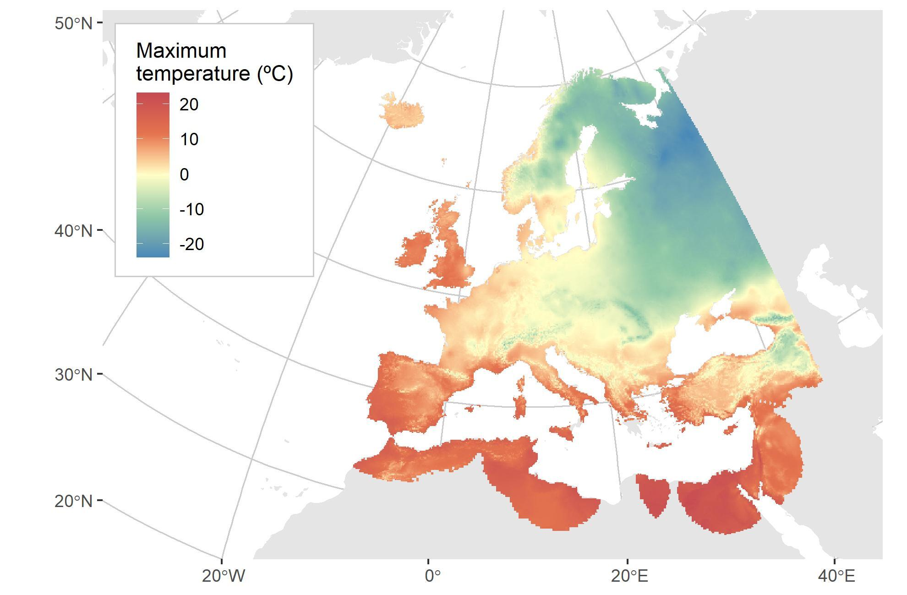
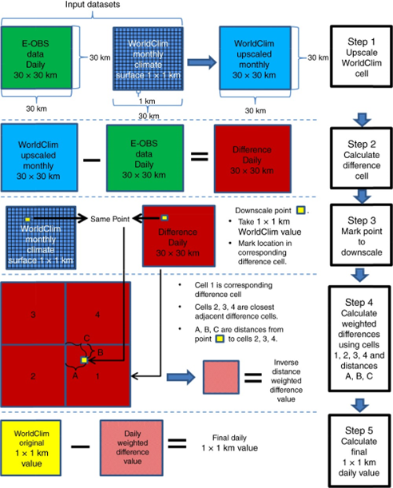
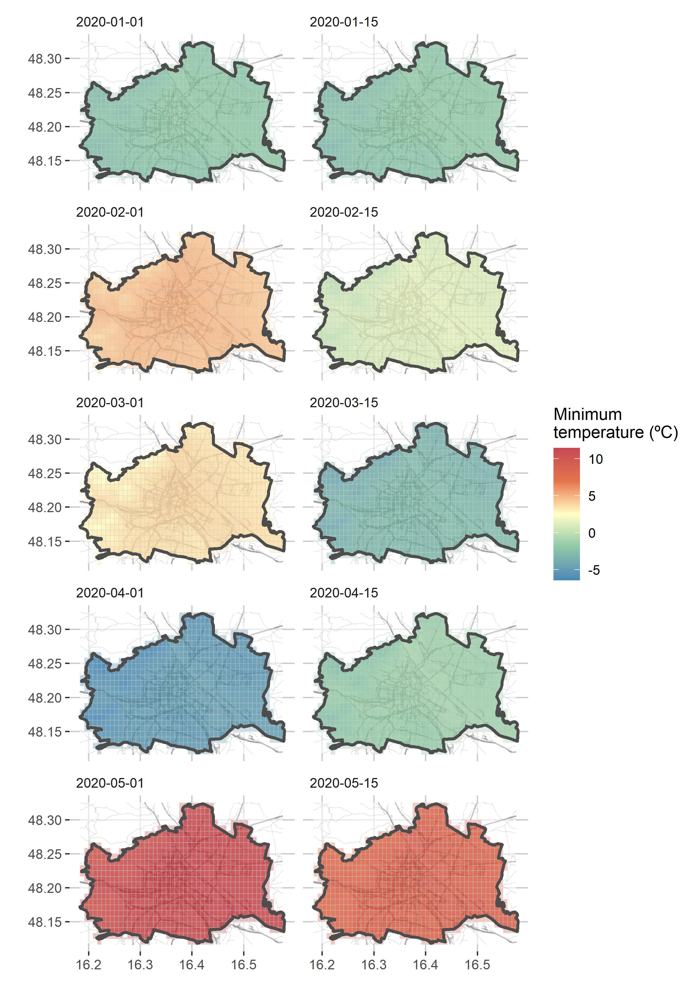

^1^ Department of Landscape Architecture, Graduate School of Design, Harvard University, USA

^2^ Universidad de Alcalá, Grupo de Ecología Forestal y Restauración (FORECO), Departamento de Ciencias de la Vida, Spain

^3^ Institute of Silviculture, Department of Forest and Soil Sciences, University of Natural Resources and Life Sciences, Austria

^4^ National Biodiversity Network Trust (NBN Trust), Nottingham, UK

^5^ Universidad de Alcalá, Grupo de Investigación en Teledetección Ambiental (GITA), Spain.

^6^ Departamento de Biología Vegetal y Ecología, Universidad de Sevilla, Spain.

^7^ Estación Biológica de Doñana, Consejo Superior de Investigaciones Científicas, Spain.

§ These authors share the first-author position.

Correspondence:

Verónica Cruz-Alonso, Harvard University, Cambridge, MA, USA. Email: [veronica.cral\@gmail.com](mailto:veronica.cral@gmail.com){.email}

# ABSTRACT

In recent decades there has been an increasing demand in environmental sciences for harmonized climatic data at large spatial scales and long periods. Here we present *easyclimate*, a software package to obtain daily climatic data at high resolution (0.0083º, \~1 km) with R. The package facilitates the downloading and processing of precipitation, minimum and maximum temperatures for Europe from 1950 to 2020. Using *easyclimate* and given a set of coordinates (points or polygons) and dates (days or years), the user can download the climatic information as a tidy table or a raster object. In this package we implemented Cloud-Optimized GeoTIFFs which provide access to daily climate data for thousands of sites/days, without having to download huge rasters. Daily climate data are not available in many of the current climate databases and are essential for many research questions and applications in environmental modelling, forestry, and ecological and vegetation studies across Europe.

*Keywords*: R package, climate, Europe, cloud-optimized geoTIFF, daily data, reproducibility

```{r setup, include=FALSE, cache=FALSE, message = FALSE}
library("knitr")
### Chunk options: see http://yihui.name/knitr/options/ ###
## Text results
opts_chunk$set(echo = TRUE, warning = TRUE, message = FALSE, out.width = "100%")
## Code decoration
opts_chunk$set(tidy = TRUE, comment = NA, highlight = TRUE)
## Cache
opts_chunk$set(cache = TRUE, cache.path = "output/cache/")
## Plots
opts_chunk$set(fig.path = "output/figures/", dpi = 300)
```

# **HIGHLIGHTS**

1.  *easyclimate* is an R package for easy access to high-resolution (0.0083°, \~1 km) daily precipitation, minimum and maximum temperature data for Europe from 1950 to 2020.

2.  It efficiently extracts data for small to moderately-sized areas by providing coordinates (points or polygons) and a time period (days or years).

3.  Data are provided as tidy datasets which can be used to calculate many varied climatic indices.

# SOFTWARE AND DATA AVAILABILITY

-   Software name: easyclimate.

-   Developer: Verónica Cruz-Alonso, Francisco Rodriguez-Sanchez, Christoph Pucher, Paloma Ruiz-Benito, Julen Astigarraga, Mathias Neumann, Sophia Ratcliffe.

-   First year available: 2021.

-   Software requirements: R statistical environment and language (version \>= 3.5.0).

-   Program language: R.

-   Cost: free.

-   License: GPL 3.0.

-   Software availability: <https://github.com/VeruGHub/easyclimate>

-   Program size: 12 KB.

-   Data availability: climate data accessed via the easyclimate package is publicly available at <ftp://palantir.boku.ac.at/Public/ClimateData/>

# 1. INTRODUCTION

In recent decades there has been an increasing demand for harmonized daily gridded climatic data at wide spatial scales and spanning long temporal periods. Such data is invaluable for vegetation, wildlife, climatic and hydrological studies and Earth system modelling [@Hasenauer2003; @Thornton2021]. Examples are the assessment of climate effects and climate change impacts on European forests [@Ruiz-Benito2020; @Hlasny2017; @Moreno2018; @Neumann2017; @Archambeau2020; @George2021], the initialization of large-scale carbon cycle models [@Pietsch2006], the spatial-temporal variability of rainfall erosivity [@MicicPonjiger2021] or the creation of a European net primary production dataset [@Neumann2016].

Plant distribution as well as plant growth, phenology, respiration and plant mortality are strongly driven by weather conditions [e.g. @Kunstler2021]. Any aggregation of climate data to average monthly or annual numbers may hide important climate effects on plants specifically if we expect changing environmental conditions. In this sense, daily climate data are of interest for many ecological research questions and applications, including the study of the effects of late-spring frosts [@Zohner2020], heat waves or dry periods on plant performance [@CruzAlonso2020]. However, accessing and processing such daily climate data is often cumbersome [@cáceres2018], even more if harmonized data are required at large spatial scales, and instead researchers use monthly or annually averaged climate data.

Here we present *easyclimate* [@easyclimatepkg], a software package (available from GitHub: <https://github.com/VeruGHub/easyclimate>) to download and process climate data with R [@R_core_team_2022]. *easyclimate* has been developed to facilitate the use of high-resolution (0.0083º × 0.0083º, \~1 km^2^) daily climate for Europe (24.5ºW, 45.25ºE, 25.25ºN, 75.5ºN; Figure 1). Daily precipitation and minimum and maximum temperature data are currently available from 1950 to 2020 and hosted at [University of Natural Resources and Life Sciences, Vienna, Austria](https://boku.ac.at/en/wabo/waldbau/wir-ueber-uns/daten).



*Figure 1: Example raster of maximum daily temperature (°C) from January 1^st^ 1950 to show the spatial coverage of the downscaled climate data.*

The climatic dataset was originally produced by Moreno and Hasenauer [@moreno2016spatial]. For the production, the coarse daily [E-Obs](https://surfobs.climate.copernicus.eu/dataaccess/access_eobs.php#datafiles) climate data [@cornes_ensemble_2018] was downscaled by using the finer-resolution [WorldClim](https://worldclim.org/data/worldclim21.html#) data [@fick_worldclim_2017]. E-Obs provides gridded daily climate data for Europe at 0.25° resolution (approximately 30 km) by interpolating around 3700 weather stations for temperature and around 9000 stations for precipitation, and WorldClim provides global long-term monthly averages of several climatic variables at 0.0083° resolution (approximately 1 km).

Downscaling was performed by applying a spatial delta method with a monotone cubic interpolation of anomalies [@Mosier2014; @moreno2016spatial]. The delta method combines climate data sets with differing spatio-temporal resolutions to produce a new climate data set with a desired spatio-temporal resolution [@moreno2016spatial]. The downscaling involves several steps (Figure 2): (i) the WorldClim data is upscaled to the 0.25° E-OBS resolution, (ii) the difference between this upscaled WorldClim and the E-OBS cell is calculated, (iii) for each 0.0083° cell in the original WorldClim data its value is retrieved and the corresponding location is marked in the difference cell, (iv) the weighted difference between the selected 0.25° cell and its closest three adjacent cells is calculated, (v) the final downscaled value is calculated using the original WorldClim value retrieved earlier and the summed inverse distance-weighted difference value [@moreno2016spatial]. The calculation of the downscaled value in the last step varies depending on weather temperature or precipitation are downscaled (see @moreno2016spatial for a more detailed description of the downscaling procedure).

{width="403"}

Evaluation and validation of the downscaled climate data were performed by comparing weather station data used for the original E-OBS data, the E-OBS data, and the downscaled data. The comparison was performed by calculating the mean, minimum and maximum values for all three data sets and error metrics for the E-OBS and downscaled data[@moreno2016spatial]. Aditionally, validation of the E-OBS and downscaled data was performed using the same statistics but with independent data from 430 Austrian weather stations which were not used to create the original E-OBS data. The validation showed that for these points the downscaling improved the accuracy of the climatic variables compared to the original E-OBS data [@moreno2016spatial].

Since its original release, the downscaled climate data set has been further developed and updated, and two releases (v2 and v3) have been published (for a review of the main changes see @Rammer2022 and @Pucher2022). The *easyclimate* R package enables easy and fast access to the latest version of the downscaled climate data (v3). We achieved this by exploiting GDAL [@gdal2022] Cloud-Optimized GeoTIFFs (<https://www.cogeo.org>) which provide access to daily climate data for thousands of sites and days within minutes, without having to download huge rasters.

# 2. FUNCTIONALITY

The main function in *easyclimate* is *get_daily_climate*, which extracts daily climate data for a given set of coordinates (points or polygons) and a given period of days or years (see examples in *get_daily_climate* [help page](https://verughub.github.io/easyclimate/reference/get_daily_climate.html), and the vignettes [Analysing the climate at spatial points for a given period](https://verughub.github.io/easyclimate/articles/points-df-mat-sf.html) and [Analysing the climate of an area for a given period](https://verughub.github.io/easyclimate/articles/polygons-raster.html)). The output can be either a `data.frame` or a (multilayer) `SpatRaster` object (Terra class; @hijmans2022) with daily climatic values for each point or polygon.

As an API (Application Programming Interface), by design, *easyclimate* yields tidy datasets [@wickham_tidy_2014] that facilitate calculation of alternative climatic variables and indices following the [tidyverse](https://www.tidyverse.org/) philosophy. Also, the results of the package *easyclimate* can be used directly or serve as input to calculate climatic indices with other packages, such as ClimInd [@climind] or SPEI [@spei] (see some examples in the vignette [Calculating basic climatic indices with data from easyclimate](https://verughub.github.io/easyclimate/articles/climatic-indices.html)). Furthermore, *easyclimate* might be integrated in other software providing environmental variables (e.g. geodata [@geodata2021]).

# 3. CASE STUDIES

Two case studies have been selected to demonstrate the core utilities of *easyclimate* and visualize the two types of data outputs (i.e. `data.frame` and `SpatRaster` objects). In addition, we show a third case where climatic variables are easily calculated based on those outputs.

## 3.1. Getting tidy datasets of climatic values

*get_daily_climate* is called to obtain precipitation data for a single site between 1^st^ and 3^rd^ of January 2001 (Table \@ref(tab:Table-1)).

```{r example df}
library(easyclimate)

coords <- data.frame(lon = -5.36, lat = 37.40)

precip <- get_daily_climate(coords,
                          period = "2001-01-01:2001-01-03",
                          climatic_var = "Prcp")
```

```{r Table-1, echo=FALSE}
kable(precip[, -1], caption = "Daily precipitation (Prcp; mm) for a given site obtained with easyclimate. Longitude (lon, x) and latitude (lat, y; WGS84) and date (YYYY-MM-DD) are also shown.")
```

## 3.2. Getting rasters of climatic values

*get_daily_climate* is called to obtain a multilayer raster with values of minimum temperature for every 15^th^ day since January 1^st^ 2020 to May 15^th^ 2020 for a region (Wien, Austria) delimited by a polygon (Figure 3).

```{r example raster}

coords.poly <- terra::subset(geodata::gadm("Austria", level = 1, path = tempdir()), NAME_1=="Wien", NSE=TRUE) 

ras_tmax <- get_daily_climate(
  coords.poly,
  period = c("2020-01-01","2020-01-15","2020-02-01","2020-02-15","2020-03-01","2020-03-15","2020-04-01","2020-04-15","2020-05-01","2020-05-15"),
  climatic_var = "Tmax",
  output = "raster"
  )

```



*Figure 3: A multilayer raster of minimum temperature values for a given polygon in ten different days of the year.*

## 3.3. Calculations based on *easyclimate* data

In the next example we download daily climatic data (precipitation, minimum and maximum temperature) for a five-year period for a specific location and store them in a `data.frame`. Then we calculate the mean temperature as the average between minimum and maximum temperature.

```{r tidy dataset}

library(dplyr)

coords <- tibble(lon = -4.88, lat = 40.82)

daily_output <- get_daily_climate(coords,
                                  period = 2010:2015,
                                  climatic_var = c("Prcp", "Tmin", "Tmax"))

daily <- daily_output |> 
  mutate(Tmean = (Tmin + Tmax) / 2)

```

To calculate average temperatures and aggregated precipitation by site or time period (Table \@ref(tab:Table-2)) we can use `group_by` and `summarise` from `dplyr`, or `by` and `aggregate` from base R.

```{r}

yearclimate <- daily |>
  mutate(year = lubridate::year(date)) |>
  group_by(year) |>
  summarise(Tmin.year = mean(Tmin),
            Tmean.year = mean(Tmean),
            Tmax.year = mean(Tmax),
            Prcp.year = sum(Prcp))

```

```{r Table-2, echo=FALSE}
kable(yearclimate, digits = 1, caption = "Yearly climatic values for a given site extracted with easyclimate. Tmin.year = Minimum temperature (ºC), Tmean.year = Mean temperature (ºC), Tmax.year = Maximum temperature (ºC), Prcp.year = Precipitation (mm)")
```

# 4. DISCUSSION

Although the entire downscaled climatic data is available for downloading as GeoTIFF raster layers in a public FTP server (<ftp://palantir.boku.ac.at/Public/ClimateData/>), for small to moderately-sized areas (e.g. less than 10000 sites or 10000 km^2^), the Cloud-Optimised GeoTIFF technology implemented in *easyclimate* allows to efficiently extract the data and can save significant time. Furthermore, with *easyclimate* we avoid downloading large rasters (several GB for each year) requiring storage space on local or remote servers, energy and resources [@Hischier2015; @Hilty2015]. In this sense, *easyclimate* becomes even more efficient if we are interested in climate data for multiple years and a small number of sites. For querying climate data from large areas, it is recommended to download the raster layers and extract the data to local storage (e.g. using the `extract` function from `terra` R package, @hijmans2022), to avoid overloading the FTP server.

As a test comparing the two methodologies (i.e. using *easyclimate* vs. raster downloading and local extraction), we downloaded daily precipitation data for one year in an area of *ca*. 100 km^2^. While the local download and extraction took 9-10 minutes in a laptop with good internet connection (\>10 MB/s, @cooper_annual_2022) and stored \~5960 Mb, *easyclimate* took \~17 seconds to obtain the same data storing only the final dataset (2.3 Mb).

```{r echo=TRUE}

library(terra)

# Method 1: Raster downloading and local data extraction

coords.poly <- terra::vect(sf::st_polygon(list(matrix(c(-5.039, 40.913, -4.919, 40.913, -4.919, 40.825, -5.039, 40.825, -5.039, 40.913), ncol = 2, byrow = TRUE))))
 
raster.url <- "ftp://palantir.boku.ac.at/Public/ClimateData/v3/AllDataRasters/prec/DownscaledPrcp2010.tif"
 
options(timeout = max(10000, getOption("timeout")))
 
system.time({
   download.file(raster.url, destfile = "prcp2010.tif", mode = "wb")
   prcp2010.ras <- terra::rast("prcp2010.tif") 
   prcp2010.data <- terra::extract(prcp2010.ras, coords.poly, xy = TRUE)
 })

```

```{r echo=TRUE}

# Method 2: Obtain the same data using easyclimate

system.time(
   prcp2010.data_2 <- get_daily_climate(
     coords.poly,
     period = 2010,
     climatic_var = "Prcp"
   )
 )

```

# 5. SUMMARY AND CONCLUSIONS

This paper presents the R package *easyclimate* which facilitates access to high-resolution daily temperature and precipitation data for Europe for the period 1950 to 2020. The package enables downloading of two types of data outputs (i.e. tidy tables and rasters). This climatic information is available by direct download from a FTP server, but the use of *easyclimate* can save time of downloading and processing and storage resources.

# ACKNOWLEDGEMENTS

We acknowledge the support by the University of Natural Resources and Life Sciences, Vienna, Austria. VCA was supported by the Real Colegio Complutense Postdoctoral Fellowship 2020. CP, MN and HH acknowledge the financial support by the Bio Based Industries Joint Undertaking under the European Union's Horizon 2020 research and innovation program TECH4EFFECT (Techniques and Technologies for Effective Wood Procurement project; grant number 720757). PRB was supported by the Community of Madrid Region and the Universidad de Alcalá (Stimulus to Excellence for Permanent University Professors, EPU-INV/2020/010; "Ayudas para la realización de Proyectos para potenciar la Creación y Consolidación de Grupos de Investigación", CG20/CC-005). JA was supported by the FPI fellowship of the Department of Education of the Basque Government. VCA, PRB and JA also acknowledge the financial support by Ministerio de Ciencia e Innovación (subproject LARGE, Nº PID2021-123675OB-C41). FRS was supported by the VI Plan Propio de Investigación of Universidad de Sevilla (VI PPIT-US), by Ministerio de Ciencia e Innovación through European Regional Development Fund (SUMHAL, LIFEWATCH-2019-09-CSIC-13, POPE 2014-2020), and by FEDER 2014-2020 and Consejería de Economía, Conocimiento, Empresas y Universidad of Junta de Andalucía (grant US-1381388).

# AUTHOR CONTRIBUTIONS

**Conceptualization:** V.C.-A., P.R.-B., and F.R.-S.\
**Data curation:** C.P. and M.N.\
**Formal analysis:** V.C.-A. and F.R.-S.\
**Funding acquisition:** M.N. and H.H.\
**Investigation:** C.P. and M.N.\
**Methodology:** V.C.-A., S.R., P.R.-B., J.A., and F.R.-S.\
**Project administration:** V.C.-A.\
**Resources:** C.P., M.N., and H.H.\
**Software:** V.C.-A., S.R., and F.R.-S.\
**Supervision:** V.C.-A., P.R.-B., and F.R.-S.\
**Validation:** V.C.-A., P.R.-B., J.A., and F.R.-S.\
**Visualization:** V.C.-A., P.R.-B., and J.A.\
**Writing - original draft:** V.C.-A. and F.R.-S.\
**Writing - review & editing:** V.C.-A., C.P., S.R., P.R.-B., J.A., M.N., H.H., and F.R.-S.

# REFERENCES

::: {#refs}
:::
